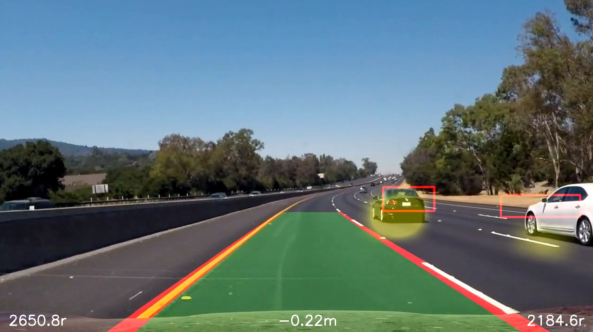

## __Lane Lines And Vehicle Detection Project__

### General Design

You will find `VehicleDetectionWithLaneLines.ipynb` as the main Jupyter Notebook for this project.  Since the lane line detection and vehicle detection began as separate projects, and the vehicle detection is a bit slower and more challenging, there is a separate Notebook with more commentary for that, called `VehicleDetection.ipynb`.  Videos are provided for the results of both of these.  Below is a screen shot from the combined video.

### Vehicle Feature Detection 

One of the most critical aspects of this project is the feature detection.  That is, to establish accurate detection with minimal false-positives.  The data that I used was the entire collection of provided vehicle and non-vehicle images, separated into a training and test set.  I did write a procedure to extract the vehicle images from the expanded image set from Udacity, but found that a lot of the images were obfuscated or were not cropped well.  These probably work well enough for neural network approaches, but I opted not to take that approach in this assignment, so I did not end up using these data sets for training and testing.  The reason for not taking the neural network approach was that it is clear that speed is of the essence with identifying cars, particularly with a sliding window approach, and a good convnet would be slower in identifying cars.  Moreover, as I will discuss later, using a combination of SVM and decision tree classifiers, I got good performance in classification against the test set.  I pre-scaled the images to 64x64 and normalized them before performing classification.

What I found that worked best for me was a combination of spatially binned RGB data, hue and saturation data after HLS conversion, and HOG data, all in roughly equal portions.  It is visually apparent that the hue information is of great use, as the cars are distinctly different hues than most of the other terrain.  However, this alone gives false-positives with trees and with the white dashed lines.  In practice I found that the combination of hue and saturation helped remedy some of the false-positives with things like trees.  As well, geometric data from the HOG procedure further helped the classification, particularly with regard to false-positive rejection.  As it turns out, simply adding in the direct spatially binned data made a significant difference as well, again with regard to false-positive rejection.  

Regarding the selection of HOG parameters, I found that 8 pixels per cell in each axis, and two cells per block in each axis, along with using nine orientations, worked the best.  This was found by varying the parameters and manually tuning them against the accuracies on the test set.  The reason the pixels per cell and cells per block were good, I believe, is because of the relative number of elements this provided compared to the number of hue/saturation and spatially binned elements.  As to the reason the nine orientations worked best, I am not sure.  My first thought is because it is relatively prime to powers of two, so does not suffer artifact issues.  However, that would be true of 7 as well, and 7 did not performa as well.  Dalal and Triggs, in their original paper on the topic, note that nine worked well for them as well, and also do not offer a convincing reason for why that is.

It is possible to observe the feature importances for the decision tree by observing the `feature_importances_` property after it is trained.  This is graphed in my project.  While there are a lot of areas with very small apparent importances, these turn out to actually be quite important in reducing false-positives.  You can see some commented out code in my `compute_spatial_hls_hog` method that reduces the feature space to those features with more substantial contributions.  This does improve the speed of classification due to reducing the feature vector size, but it is more error prone.  I ended up leaving all of the features for my final submission.

Once the SVM and decision tree classifiers have produced a result for a given image, I determine a combined result by logically ORing them.  The reason for this is that it appears that this produces better results than either classifier alone.  That is to say, performing this operation reduces missed positive features more than it adds false-positives.

Since it is time consuming to traing the classifiers, I save the entire classification class to disk using `pickle` so that it is easy to use at a later time by the image processing classes.

### Vehicle Detection Pipeline Overview

The general idea of the pipeline is as follows:

 1. Constrain the field of vision to a polygon that roughly defines the lanes to the right of the our car and only extends to the mid-range horizon.  Reason for this is these are the more important vehicles to identify that are a risk, and there is no need to waste time on the rest of the frame. The far horizon is excluded because those cars are not threats.
 2. With this polygon create tiled square sub-regions.  The regions at the top portion of the frame are smaller than those at the bottom. In my implementation they scale linearly between.  This is clearly not the most accurate way of doing this at the far horizon, but we are not evaluating the far horizon as those cars are not threats.  They also overlap left to right, but retain the same size per row.
 3. For each region, determine if it is or is not a car.  The region is scaled and evaluated by the classifier.
 4. On a blank overlay, draw a color heat map of the centers of the regions that are classified as cars for display on a per-frame basis on the full frame.  In the resulting video, these are the yellow marks.
 5. On a separate blank overlay, draw an intensity heat map of the centers of the regions that are classified as cars.  This heat map uses larger areas than the first, and of lower intensity.  The reason for this is that we will be computing with it not only spatially, but across several consecutive frames, and do not want to saturate it.
 6. Over the course of several frames, the intensity heat maps are combined.  The resulting heat map is one taking into account spatial and temporal identifications of cars.  The idea being that the highest density spatio-temporal volumes are the best estimates for the cars.  This is then projected to the two dimensional image to identify the location.
 7. A threshold is performed on the spatio-temporal heat map, which is then used to determine the largest regions by area.  We only keep a maximum number of these regions, and only those larger than a pre-defined area.  The centers are retained to be used for region consistency detection and tracking.
 8. The detected regions from the above procedure are fed to a mechanism that tracks if we have seen the region (whether it is within some distance tolerance or not of a currently known region).  This allows us to apply averaging to those regions we have seen and the ability to provide better confidence in detection to these regions by only allowing the display of those regions with a certain likelihood of repeat detection.
 9. Once the centers have been detected and averaged, the bounding box is determined.  The bounding box is determined using an initial starting point and a bound size guess (constant), and a method that uses binary image moments and specific percentile intervals of the marginal lengths (height and width) of the binary image to refine an estimate of the bounding box.  The image that is used is made binary by selecting colors in the saturation portion of HLS color space.
 10. The bounding box is overlayed on the video frame.  This is the red box in the frame.  

### Lane Detection Pipeline Overview

There are preliminary steps that the pipeline engages:

1. Loads all images from the camera_cal folder and uses them to compute the calibration matrix and distortion coefficients based on the chessboard images.
2. Opens the video, iterating over the images.
3. Each image is corrected for distortion and a grayscale is created.
4. For the first few images simply detect the lanes and fit to a 2nd degree polynomial; these frames are not part of the output.  The polynomial coefficients are what are averaged over several frames to prevent jitter and missed frames.  
5.  For the rest of the images, the lane is detected and is fit to a 2nd degree polynomial as before, but with frame output.  If the difference between the current from and the average is within a set tolerance, the new frame data is added to the averaging and the average is used for the curvature metrics and drawing.  If it is not within tolerance, the data is discarded and the prior average is used.

When I say the lanes are detected, what I really mean is:

1. The (distortion corrected) image is tranlated to a bird's eye view. The transformation is based on point mappings that were manually derived from the (distortion corrected) lane images.  The projection to a bird's eye view was done here becaue it works better the way I designed my classes, which is possible since this operation and the color operations commute.
2. Image data is then used to created a binary image based on the following:
	* HLS binary image of lightness within a range
	* HLS binary image of saturation within a range
	* Binary image of Sobel directional data within a range
	* All of the above binary images effectively ANDed together (Hadamard product on binary image data)
	* The specific procedure was generated by optimization on static images
3. A histogram is generated from the bottom half of the binary image:
	* Verticals are tallied in the row tranches
	* A sum-of-two-Gaussians profile is applied to the tally (reduces the effect of roadside noise and central lane noise)
	* k-means clustering is used to detect the centroids of two clusters.  This works very well for visually well-identified clusters, but is not as accurate when there is significant central road noise (e.g. tree shadow). However, if fails gracefully in a regressive sense of indicating toward the lane center. 
	* A region of interest is identified from the centroids and then bounded to reasonable limits for the image
4. Image tracing is used to define points along the lane lines on a per lane line basis:
	* Based on the region of interest, the sum of row elements in a vertical tranche is computed
	* The centroid of the tranche is computed
	* The next tranche region of interest is of the same width, but centered around the newly computed centroid
	* If the next tranche does not exceed a specified threshold (e.g. no lane marks on the dashed lane lines), it is presumed to simply traverse vertically to the next tranche.
5. For each traced image, the points are fit to a 2nd degree polynomial.
6. The radius of curvature is determined by analytic computation based on the 2nd degree polynomial.
7. Car position in lane is determined from the average of the two nearest lane point, which is the road center, and a static constant representing the car's position when actually centered.  This figure is scaled to meters.
8. The average of the prior few polynomial coefficients for each lane line are compared with the current polynomial coefficients.  If the error is within a specified tolerance, the new coefficients are added (the least recent is removed) and the average is used to compute the displayed lane lines.  If the error is not within tolerance, the prior average is used instead (effectively trashing the current detection).
9. The region of interest (lane) and the boundaries (lane lines) are drawn on the image based on extrapolating points using the polynomial coefficients.
10. The drawn region is transformed back to the car camera perspective from the bird's eye perspective.  
11. Text is overlaid on the image regarding the estimated left and right lane line radii and the car deviation from lane center

### Results and Opportunities For Improvement

Lane finding using the top view projection technique works surprisingly well. I found that using k-means clustering to estimate the central position of the lane lines near the car based on histograms of the bottom half of the frame was quite accurate.  This was improved upon by applying a sum-of-Gaussians filter to the histograms to reject areas away from the guessed center of the lane lines.  It was quite surprising how well a second degree polynomial fits the curve of the lane lines from the overhead perspective.  Making the lane lines themselves distinct was accomplished by considering the HLS color space and bounded direction of Sobel gradients.  The frames are corrected for lens distortion first. 

The vehicle detection aspect of this assignment is pretty hard to get to work well.  It certainly gave me a new appreciation for what Drew Gray said about the problems at Otto with false-positive rejection.  The things that are hard are getting the best classifier possible at the early stages of detection so that you can decrease the number of regions detected with the sliding window approach.  Also, getting the spatio-temporal detection to work well, particularly with tracking the identified regions, can be tricky to get right.  It is also rather hard to get a simple sliding window mechanism to generate good boundaries for the vehicle.  I tried a lot of different ways to improve the boundaries (clustering Sobel frames to detect the edges, selecting the longest contours from binary images based on Sobel frames).  In the end I used a bounding box that uses the image moments on the color space filtered binary image, as this was the most robust of the options that I tried.  

One of the biggest downfalls of this method of vehicle detection is its sensitivity to the tiling that is used.  Since we are using overlapping tiling and depending on that overlap to reinforce classification results, the approach is quite sensitive to the effects of the size of the tiling and the overlap percentage with regard to the time it takes to process a frame.  I feel that I do not get adequate results without depending on fairly significant overlap in the tiling, and with regions that are selected to be roughly the size of the car.  There are diminishing returns with respect to accuracy as the rate that we can process frames slows, but to get an acceptable accuracy using this approach we must do this.  

One implication of the above thoughts on speed is that the training data and/or classification mechanism is is to blame for bad performance.  This data could be reviewed or augmented to help train the classifier better.  The examples from the training data do not, for example, have a lot of white cars, so it is no surprise that the white car is the one that proves harder to track.  Some options that could improve results would be expanding the training set, using augmentation to generate additional training data, further adjusting classification parameters, or using an entirely different approach to classification of the regions. 

While slow, the approach taken works reasonably well.  The white car misses identification for two reasons.  First, when it is on the white pavement, the contrast between the car and the surroundings is low.  HOG features, which have significant performance in classifying the cars, experience a disadvantage in this area due to the low contrast and reduced ability to produce recognizable spatial features.  Later in the video, as the white car moves to the horizon, the bounding box for the frame intersects the location of the car.  This reduces the likelihood of affirmative detection in any one frame, and consequently reduces the ability of the spatio-temporal heat map to identify a sufficient region to mark as a car.

Areas where this project could be improved are: better baseline classification so that the tiling does not require as much overlap, better tiling interpolation in the vertical direction since linear interpolation does not match the car size as a function of vertical position, enhanced parameter selection to optimize the spatio-temporal heat map used to identify cars, and a better means to identify the bounding box of a car based on an intial guess regarding the center of the car.
